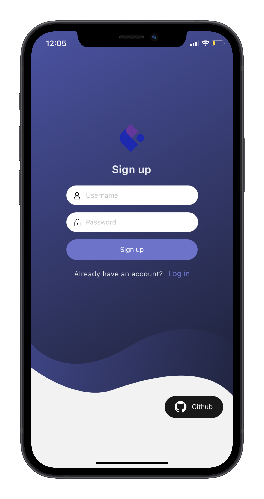

# Image Sharing Social App

## Description
A full-stack personal project made to explore the use of mobile-first technology. This app is a hybrid between Pinterest and Instagram and allows users the ability to upload pictures thanks to the use of a javascript library called Multer. The pictures are then stored in AWS S3 Bucket, which is then received on the React Native frontend to later be displayed.
 Home Feed             |  Profile Page
:---------------------:|:-------------------------:
  |  

 Login             |  Sign up
:-------------------------:|:-------------------------:
  |  

## Technologies Used

| Frontend     | Backend        |  
| ------------- | ------------- | 
| [![React][React.js]][React-url]       | [![Angular][Angular.io]][Angular-url]         | 
| [![Vue][Vue.js]][Vue-url]         | [![Svelte][Svelte.dev]][Svelte-url]         | 
| [![JQuery][JQuery.com]][JQuery-url]        | ![Laravel][Laravel.com]     | 
| [![JQuery][linkedin-url]][linkedin-url]       | [![Bootstrap][Bootstrap.com]][Bootstrap-url]         | 
| [![JQuery][contributors-url]][linkedin-url]       | [![JQuery][Vue-url]][linkedin-url]         | 

[contributors-shield]: https://img.shields.io/github/contributors/othneildrew/Best-README-Template.svg?style=for-the-badge
[contributors-url]:https://img.shields.io/badge/Figma-F24E1E?style=for-the-badge&logo=figma&logoColor=white
[forks-shield]: https://img.shields.io/github/forks/othneildrew/Best-README-Template.svg?style=for-the-badge
[forks-url]: https://github.com/othneildrew/Best-README-Template/network/members
[stars-shield]: https://img.shields.io/github/stars/othneildrew/Best-README-Template.svg?style=for-the-badge
[stars-url]: https://github.com/othneildrew/Best-README-Template/stargazers
[issues-shield]: https://img.shields.io/github/issues/othneildrew/Best-README-Template.svg?style=for-the-badge
[issues-url]: https://github.com/othneildrew/Best-README-Template/issues
[license-shield]: https://img.shields.io/github/license/othneildrew/Best-README-Template.svg?style=for-the-badge
[license-url]: https://github.com/othneildrew/Best-README-Template/blob/master/LICENSE.txt
[linkedin-shield]: https://img.shields.io/badge/-LinkedIn-black.svg?style=for-the-badge&logo=linkedin&colorB=555
[linkedin-url]: https://img.shields.io/badge/GraphQl-E10098?style=for-the-badge&logo=graphql&logoColor=white
[product-screenshot]: images/screenshot.png
[Next.js]: https://img.shields.io/badge/next.js-000000?style=for-the-badge&logo=nextdotjs&logoColor=white
[Next-url]: https://nextjs.org/
[React.js]: https://img.shields.io/badge/React_Native-20232A?style=for-the-badge&logo=react&logoColor=61DAFB
[React-url]: https://reactjs.org/
[Vue.js]: https://img.shields.io/badge/Expo-1B1F23?style=for-the-badge&logo=expo&logoColor=white
[Vue-url]: https://img.shields.io/badge/JWT-000000?style=for-the-badge&logo=JSON%20web%20tokens&logoColor=white
[Angular.io]:https://img.shields.io/badge/Node.js-339933?style=for-the-badge&logo=nodedotjs&logoColor=white
[Angular-url]: https://angular.io/
[Svelte.dev]: 	https://img.shields.io/badge/Express.js-000000?style=for-the-badge&logo=express&logoColor=white
[Svelte-url]: https://svelte.dev/
[Laravel.com]: 	https://img.shields.io/badge/MySQL-005C84?style=for-the-badge&logo=mysql&logoColor=white
[Laravel-url]: https://laravel.com
[Bootstrap.com]: https://img.shields.io/badge/Amazon_AWS-FF9900?style=for-the-badge&logo=amazonaws&logoColor=white
[Bootstrap-url]: https://getbootstrap.com
[JQuery.com]: https://img.shields.io/badge/Bootstrap-563D7C?style=for-the-badge&logo=bootstrap&logoColor=white
[JQuery-url]: https://jquery.com 